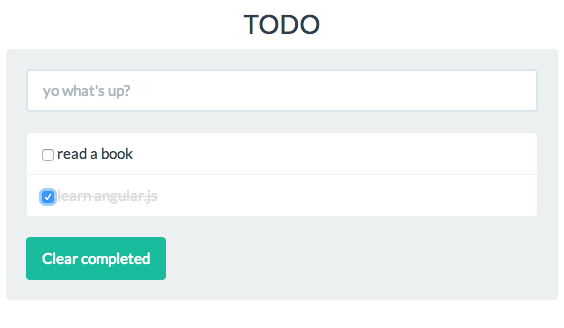

Plain simple TODO app
===


Written with [AngularJS](http://angularjs.org), styled with [Bootstrap](http://getbootstrap.com/), [Flatly theme](http://bootswatch.com/flatly/).



### Install

1. Install [nvm](https://github.com/creationix/nvm)

```
curl https://raw.githubusercontent.com/creationix/nvm/v0.21.0/install.sh | bash
```

2. Install stable [nodejs](http://nodejs.org/) version:

```
nvm install stable
nvm use stable
```

3. (Optional) Update [npm](https://www.npmjs.com/) to latest version:

```
npm install npm -g
```

4. Install dependent packages:

```
npm install
```


### Run tests

1. End-to-end tests:

```
npm run protractor
```
	
2. Unit tests:

```
npm test
```